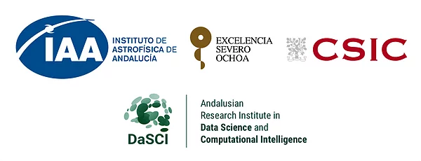

# SOMACHINE 2021
## Machine Learning, Big Data, and Deep Learning in Astronomy

### A Severo Ochoa School of the Instituto de Astrofísica de Andalucía (CSIC)



- [School materials](#school-materials)
  * [Tutorials](#tutorials)
  * [Talks](#talks)
- [Execution of the tutorials](#execution-of-the-tutorials)
  * [Option 1. Execute notebook tutorials on the cloud](#option-1-execute-notebook-tutorials-on-the-cloud)
  * [Option 2. Execute notebook tutorials in the JupyterHub instance at IAA-CSIC](#option-2-execute-notebook-tutorials-in-the-jupyterhub-instance-at-iaa-csic)
  * [Option 3. Execute notebook tutorials in your local machine](#option-3-execute-notebook-tutorials-in-your-local-machine)
    + [Install conda](#install-conda)
    + [Get the contents of the school](#get-the-contents-of-the-school)
- [Credits and acknowledgements](#credits-and-acknowledgements)

This repository hosts the materials for the school and instructions on how to run the tutorials. It also contains a conda environment needed to execute the python notebooks, either locally or in a cloud platform.

The main web page of the school is [https://www.granadacongresos.com/somachine2021](https://www.granadacongresos.com/somachine2021). It contains general information, registration, topics, tutors and the daily schedule. 
# School materials

## Tutorials
- **Tutorial 01+02: Practical ML: Scikit-learn**  (Juan Antonio Cortés, UGR)
    - [Practical ML: Introduction to Scikit-learn (notebook)](tutorials/tutorial_01_ML/tutorial_ML.ipynb)
    - [Practical ML: Classical Problems with Scikit-learn (notebook)](tutorials/tutorial_01_ML/tutorial_ML.ipynb)
- **Tutorials 03+04: Big Data: Algorithms and Spark, Data Analysis with Spark** (Diego García, UGR)
    - [Apache Spark installation (pdf)](tutorials/tutorial_03_BD_spark/Apache%20Spark%20installation.pdf)
    - VM to be downloaded [link](https://drive.google.com/file/d/1RvOYHH58bNZZ_sbJ_s8xt7gNgkdHzAUr/view?usp=sharing) (password: `somachine20`) 
    - [Data](tutorials/tutorial_03_BD_spark/datasets.zip)
    - [Scala scripts](tutorials/tutorial_03_BD_spark/Scripts/)
- **Tutorial 05: Practical DL: A Quick Glance** (Francisco Pérez, UGR)
   - [Practical Deep Learning: A quick glance (pdf)](tutorials/tutorial_05_DL/Practical%20Deep%20Learning_%20A%20quick%20glance.pdf)
   - [Galaxy Classification (notebook)](tutorials/tutorial_05_DL/Galaxy10.ipynb)

## Talks
- Placing AI and ML in Context - Jorge Casillas, UGR
- [Theoretical Foundations of ML: Classical Problems, Algorithms and Validation - Julián Luengo, UGR](talks/ML_Basics_LUENGO.pdf)
- [Data Preprocessing in ML - Julián Luengo, UGR](talks/ML_Data_preprocessing_LUENGO.pdf)
- [Singular Problems in ML - Salvador García, UGR](talks/ML_singular_problems_GARCIA.pdf)
- [ML in Astronomy: An Overview - Kyle Boone, University of Washington](talks/ML_in_astronomy_BOONE.pdf)
    - Normalizing flows for the HR diagram
       - [Paper](https://ui.adsabs.harvard.edu/abs/2019arXiv190808045C/abstract)
       - [Notebook that was used to generate the plots in the talk](https://github.com/AstroHackWeek/AstroHackWeek2020/blob/master/hacks/smoothflows/isochrone_nflows.ipynb)
    - Examples of autoencoder applications
       - [Classification of light curves](https://ui.adsabs.harvard.edu/abs/2020ApJ...905...94V/abstract)
       - [Generative models of galaxies](https://ui.adsabs.harvard.edu/abs/2016arXiv160905796R/abstract)
       - [Deblending galaxies](https://ui.adsabs.harvard.edu/abs/2021MNRAS.500..531A/abstract)
- [Galaxy classification in surveys - Helena Domínguez Sánchez, ICE-CSIC](talks/galaxy_classification_DOMINGUEZ.pdf)
- [Big Data: Foundations and Frameworks - Alberto Fernández, UGR](talks/big_data_foundations_frameworks_FERNANDEZ.pdf)
- Big Data: Algorithms and Spark (Theoretical and Practical) - Diego García, UGR
- BD in Astronomy: An Overview - Federica Bianco, University of Delaware
- [Vera C. Rubin Observatory: A Big Data Machine for the 21st Century - Meredith Rawls, Vera Rubin Observatory](Rubin_Data_RAWLS.pdf)
- Theoretical Foundations of DL and CNNs - Anabel Gómez, UGR
- Autoencoders: An Overview and Applications - David Charte, UGR
- Successful case studies of DL - Siham Tabik, UGR
- An Overview of Deep Learning in Astronomy - Ashish Mahabal, Caltech
- Emulators and their application to supernova data	- Wolfgang Kerzendorf, Michigan State University
- The SKA Telescope Data Deluge - Javier Moldón, IAA
- The SKA Telescope Data Challenges - Anna Bonaldi, SKAO 
- Applications of unsupervised learning to astronomical datasets - Dalya Baron, Tel Aviv University
- Deep Learning and Image Reconstruction - Andrés Asensio, IAC

Recordings of the talks are available at http://u.pc.cd/ybT. Some of the talks are the same or very similar to the ones from [somachine2020](https://github.com/spsrc/somachine2020#talks)

# Execution of the tutorials

Tutorials 01, 02 and 05 can be followed as Jupyter notebooks using python. Information below shows how to run those notebooks on cloud services or in your local machine. Tutorials 03 and 04 use Spark, which you can install in your machine (see instructions [here](tutorials/tutorial_03_BD_spark/Apache%20Spark%20installation.pdf)) or can be executed using the Virtual Machine (VM) provided above.

There are three options to execute the Jupyter notebook tutorials using python (01, 02 and 05). Choose whatever suits you more:

- Execute tutorials on the cloud using myBinder. A temporary virtual machine will be created in myBinder.org containing a Jupyter Lab and the corresponding notebooks. No user access required, just follow the link. This service is temporary, so nothing stored here will persist, and the machine will be removed automatically and without warning after some time of inactivity.
- Execute tutorials on JupyterHub instance at IAA-CSIC. Similar to first option, but the virtual machines will be served by Jupyter Hub deployed on the host institution (IAA). You need to login to your dedicated machine (see below for credentials) and the Jupyter instance will be available for two weeks from the start of the school. Your progress will be stored and can be retrieved every time you access the service. You can use this service to experiment and work on your own files.
- Use your own machine. This repository contains a conda environment to help you install all the required software.


## Option 1. Execute notebook tutorials on the cloud

Interactive mybinder link to execute the python notebooks:

[![badge](https://img.shields.io/badge/launch-binder-579ACA.svg?logo=data:image/png;base64,iVBORw0KGgoAAAANSUhEUgAAAFkAAABZCAMAAABi1XidAAAB8lBMVEX///9XmsrmZYH1olJXmsr1olJXmsrmZYH1olJXmsr1olJXmsrmZYH1olL1olJXmsr1olJXmsrmZYH1olL1olJXmsrmZYH1olJXmsr1olL1olJXmsrmZYH1olL1olJXmsrmZYH1olL1olL0nFf1olJXmsrmZYH1olJXmsq8dZb1olJXmsrmZYH1olJXmspXmspXmsr1olL1olJXmsrmZYH1olJXmsr1olL1olJXmsrmZYH1olL1olLeaIVXmsrmZYH1olL1olL1olJXmsrmZYH1olLna31Xmsr1olJXmsr1olJXmsrmZYH1olLqoVr1olJXmsr1olJXmsrmZYH1olL1olKkfaPobXvviGabgadXmsqThKuofKHmZ4Dobnr1olJXmsr1olJXmspXmsr1olJXmsrfZ4TuhWn1olL1olJXmsqBi7X1olJXmspZmslbmMhbmsdemsVfl8ZgmsNim8Jpk8F0m7R4m7F5nLB6jbh7jbiDirOEibOGnKaMhq+PnaCVg6qWg6qegKaff6WhnpKofKGtnomxeZy3noG6dZi+n3vCcpPDcpPGn3bLb4/Mb47UbIrVa4rYoGjdaIbeaIXhoWHmZYHobXvpcHjqdHXreHLroVrsfG/uhGnuh2bwj2Hxk17yl1vzmljzm1j0nlX1olL3AJXWAAAAbXRSTlMAEBAQHx8gICAuLjAwMDw9PUBAQEpQUFBXV1hgYGBkcHBwcXl8gICAgoiIkJCQlJicnJ2goKCmqK+wsLC4usDAwMjP0NDQ1NbW3Nzg4ODi5+3v8PDw8/T09PX29vb39/f5+fr7+/z8/Pz9/v7+zczCxgAABC5JREFUeAHN1ul3k0UUBvCb1CTVpmpaitAGSLSpSuKCLWpbTKNJFGlcSMAFF63iUmRccNG6gLbuxkXU66JAUef/9LSpmXnyLr3T5AO/rzl5zj137p136BISy44fKJXuGN/d19PUfYeO67Znqtf2KH33Id1psXoFdW30sPZ1sMvs2D060AHqws4FHeJojLZqnw53cmfvg+XR8mC0OEjuxrXEkX5ydeVJLVIlV0e10PXk5k7dYeHu7Cj1j+49uKg7uLU61tGLw1lq27ugQYlclHC4bgv7VQ+TAyj5Zc/UjsPvs1sd5cWryWObtvWT2EPa4rtnWW3JkpjggEpbOsPr7F7EyNewtpBIslA7p43HCsnwooXTEc3UmPmCNn5lrqTJxy6nRmcavGZVt/3Da2pD5NHvsOHJCrdc1G2r3DITpU7yic7w/7Rxnjc0kt5GC4djiv2Sz3Fb2iEZg41/ddsFDoyuYrIkmFehz0HR2thPgQqMyQYb2OtB0WxsZ3BeG3+wpRb1vzl2UYBog8FfGhttFKjtAclnZYrRo9ryG9uG/FZQU4AEg8ZE9LjGMzTmqKXPLnlWVnIlQQTvxJf8ip7VgjZjyVPrjw1te5otM7RmP7xm+sK2Gv9I8Gi++BRbEkR9EBw8zRUcKxwp73xkaLiqQb+kGduJTNHG72zcW9LoJgqQxpP3/Tj//c3yB0tqzaml05/+orHLksVO+95kX7/7qgJvnjlrfr2Ggsyx0eoy9uPzN5SPd86aXggOsEKW2Prz7du3VID3/tzs/sSRs2w7ovVHKtjrX2pd7ZMlTxAYfBAL9jiDwfLkq55Tm7ifhMlTGPyCAs7RFRhn47JnlcB9RM5T97ASuZXIcVNuUDIndpDbdsfrqsOppeXl5Y+XVKdjFCTh+zGaVuj0d9zy05PPK3QzBamxdwtTCrzyg/2Rvf2EstUjordGwa/kx9mSJLr8mLLtCW8HHGJc2R5hS219IiF6PnTusOqcMl57gm0Z8kanKMAQg0qSyuZfn7zItsbGyO9QlnxY0eCuD1XL2ys/MsrQhltE7Ug0uFOzufJFE2PxBo/YAx8XPPdDwWN0MrDRYIZF0mSMKCNHgaIVFoBbNoLJ7tEQDKxGF0kcLQimojCZopv0OkNOyWCCg9XMVAi7ARJzQdM2QUh0gmBozjc3Skg6dSBRqDGYSUOu66Zg+I2fNZs/M3/f/Grl/XnyF1Gw3VKCez0PN5IUfFLqvgUN4C0qNqYs5YhPL+aVZYDE4IpUk57oSFnJm4FyCqqOE0jhY2SMyLFoo56zyo6becOS5UVDdj7Vih0zp+tcMhwRpBeLyqtIjlJKAIZSbI8SGSF3k0pA3mR5tHuwPFoa7N7reoq2bqCsAk1HqCu5uvI1n6JuRXI+S1Mco54YmYTwcn6Aeic+kssXi8XpXC4V3t7/ADuTNKaQJdScAAAAAElFTkSuQmCC)](https://mybinder.org/v2/gh/spsrc/somachine2021/master?urlpath=lab/tree/tutorials/index.ipynb)

or follow this [link](https://mybinder.org/v2/gh/spsrc/somachine2021/master?urlpath=lab/tree/tutorials/index.ipynb)

[myBinder.org](https://mybinder.org) is a free and open organization providing free cloud resources. Therefore, the resources may be limited and the changes you make in the notebooks or the system are not persistent. Please, always keep a local copy of any file you want to keep, because Binder will automatically eliminate the virtual machine assigned to you after some time of inactivity.

## Option 2. Execute notebook tutorials in the JupyterHub instance at IAA-CSIC

The [IAA-CSIC Severo Ochoa Center](http://so.iaa.csic.es/) provides a prototype JupyterHub instance available here:

[https://spsrc-jupyter.iaa.csic.es/somachine/](https://spsrc-jupyter.iaa.csic.es/somachine/)

Login with user: `firstname.lastname`, password: `lastname`.

It will take some minutes to create the instance (especially the first time you access). You can access your instance in `https://spsrc-jupyter.iaa.csic.es/user/<username>/lab/` and you can start by using the navigation bar on the left to open the file `somachine2021/tutorials/index.ipynb`.

A lightweight desktop is also available, you can access it immediately by changing `lab` to `desktop` in the path. For example go to: `https://spsrc-jupyter.iaa.csic.es/user/<username>/desktop/` and you will have a desktop environment with graphical interface in your browser.

Contrary to option 1, these instances offer persistent storage throughout the duration of the school. **All virtual machines and their contents will be removed by the 2nd of May, 2021.**

In case of problems using this JupyterHub instance please file an issue at https://github.com/spsrc/somachine2021/issues

## Option 3. Execute notebook tutorials in your local machine

### Install conda

We recommend using `conda` to manage the dependencies. Miniconda is a light-weight version of Anaconda. First we show how to install Miniconda if you don't have it already. More details [here](https://docs.conda.io/projects/conda/en/latest/user-guide/install/linux.html)

Miniconda for Linux:
```bash
curl -O https://repo.anaconda.com/miniconda/Miniconda3-latest-Linux-x86_64.sh
bash ./Miniconda3-latest-Linux-x86_64.sh
rm ./Miniconda3-latest-Linux-x86_64.sh
```

Miniconda for macOS:
```bash
curl -O https://repo.anaconda.com/miniconda/Miniconda3-latest-MacOSX-x86_64.sh
bash Miniconda3-latest-MacOSX-x86_64.sh
rm Miniconda3-latest-MacOSX-x86_64.sh
```

Note that the installation will suggest you to modify your bashrc so conda is always available, which is a good idea in general. Alternatively, if you want the Miniconda installation to be encapsulated in your working directory without affecting the rest of your system you can install it with the following option. The first command only needs to be done once, and the second one needs to be done everytime you open a new terminal. 

```bash
bash ./Miniconda3-latest-Linux-x86_64.sh -b -p my_conda_env
source my_conda_env/etc/profile.d/conda.sh
```

### Get the contents of the school

Download this repository and create conda environment with the dependencies
```bash
git clone https://github.com/spsrc/somachine2020.git
cd somachine
conda env create -f environment.yml
conda activate somachine
```

If you want to use Jupyer Lab:
```bash
conda install -c conda-forge jupyterlab
jupyter lab
```


# Credits and acknowledgements

This repository and the Jupyter Hub service for the tutorials are provided by the SKA Regional Centre Prototype, which is funded by the State Agency for Research of the Spanish MCIU through the "Center of Excellence Severo Ochoa"; award to the Instituto de Astrofísica de Andalucía (SEV-2017-0709), the European Regional Development Funds (EQC2019-005707-P), by the Junta de Andalucía (SOMM17_5208_IAA), project RTI2018-096228-B-C31(MCIU/AEI/FEDER,UE) and PTA2018-015980-I.
